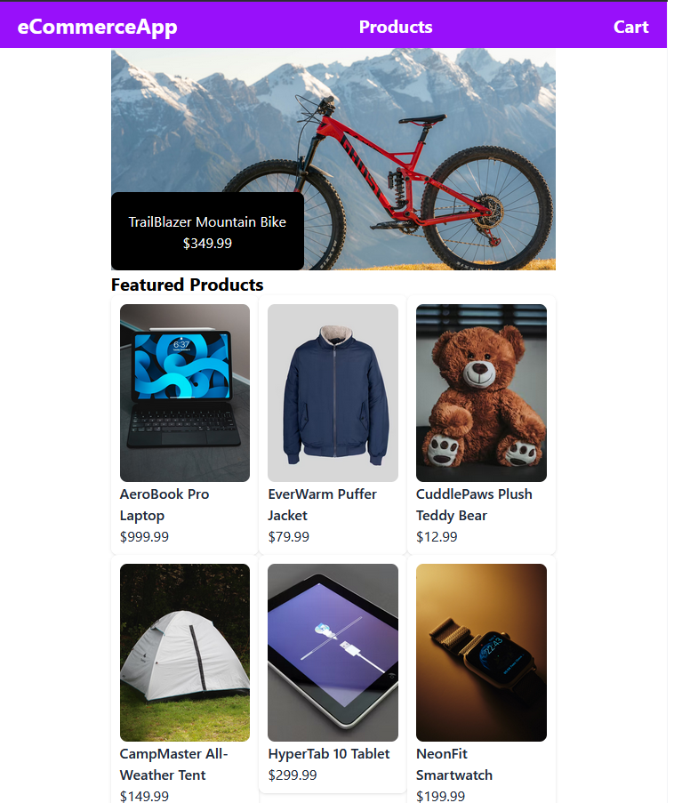

# 🛒 E-commerce Website

## Overview
A modern e-commerce single-page application built with React, TypeScript, and Next.js. Features a rotating product carousel, category filtering, and a functional shopping cart with real-time cost calculation.

## 🌐 Live Demo
**[View Live Site](https://e-commerce-app-next-red.vercel.app)** ⭐ Try it out without any setup!

## ✨ Key Features
- 🎠 **Rotating featured product carousel** on the homepage for highlighted items
- 🔍 **Category filtering** to browse products by type
- 📦 **Product grid and recommended items** for enhanced discovery
- 🛍️ **Individual product pages** with detailed views
- 🛒 **Shopping cart** with add-to-cart functionality and real-time total calculation
- 📱 **Fully responsive design** optimized for mobile and desktop

## 🔧 Tech Stack
**Frontend:** React • TypeScript • Next.js • Tailwind CSS  
**State Management:** Zustand  
**Testing:** Jest  

## 🚀 Installation & Setup

1. Clone the repository
2. Install dependencies with `npm install`
3. Run the development server with `npm run dev`
4. Open your browser to `http://localhost:3000`

## 📖 How It Works
1. **Browse products** via the homepage and products page
2. **Filter by category** to find specific product types
3. **Click on a product** to view detailed information
4. **Add items to cart** and see the total cost update in real-time
5. **View cart summary** with all selected items and pricing

## 🎯 Development Highlights
- **Component-based architecture** for reusable UI elements
- **TypeScript** for type safety and better developer experience
- **Zustand state management** for lightweight, efficient global state
- **Next.js** for optimized performance and routing
- **Tailwind CSS** for rapid, responsive styling
- **Jest testing** for component reliability